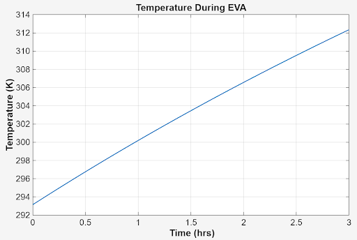
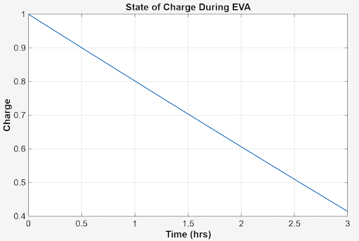
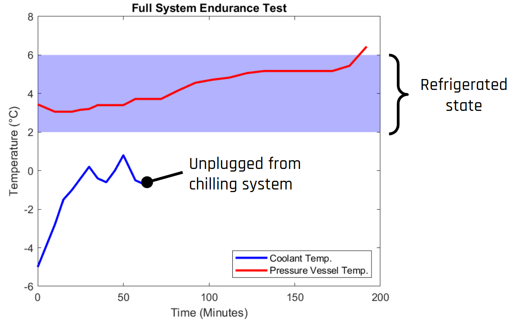
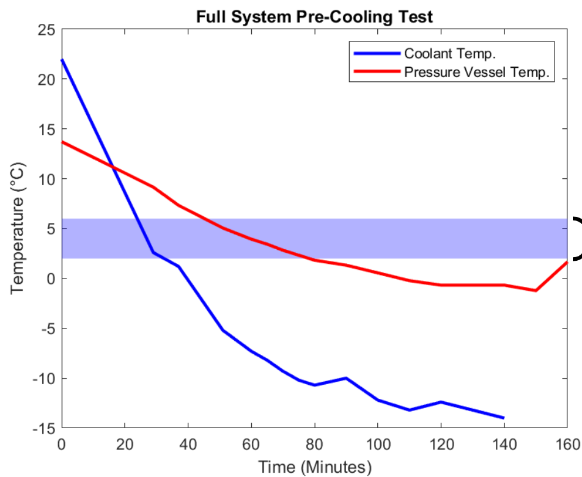
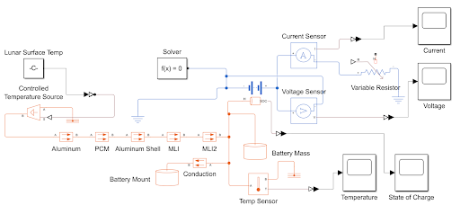
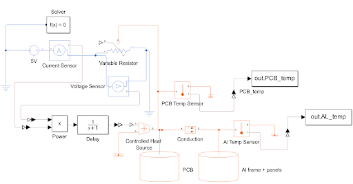
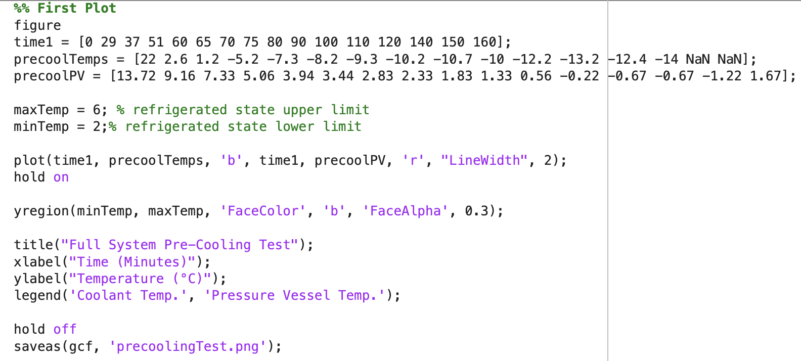
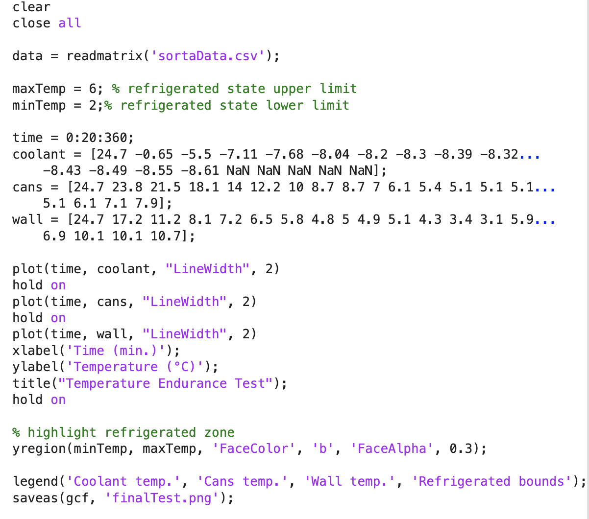

# MBSE & MathWorks systems handbook

## Description
This repository contains documentation demonstrating the use of MathWorks systems in the design of a Lunar Sample Containment System. All material was created by a team of undergraduates at the University of Michigan as part of a project associated with the [Aerospace X88](https://aero.engin.umich.edu/undergraduate/program-overview/mbse-at-u-m/) course series and [NASA’s RASC-AL](https://rascal.nianet.org/) competition. To successfully design this system, MBSE methodologies were followed, such as moving through the systems V diagram from requirements to final verification and validation. In this project, MathWorks systems were primarily utilized during the verification and validation portions of the design process. MATLAB provides suitable data analysis tools to confirm requirements and identify any malfunctions in the system. Simulink was used to lay out electronic systems and controls, such as identifying the temperature in the control volume and verifying their functionality. The system itself is designed to maintain the temperature and pressure needed to store lunar samples during transit between habitats or rovers on lunar missions. Some of the systems demonstrated in this repository include the temperature sensing and warning system, the battery power and control system, as well as the cooling system itself.
## Examples

<table>
<tr>

<td align="center">
  
   
  <b>Modeling of tempurature over time</b>
   
  <small> Using MATLAB, test data was modeled to approximate the rate at which the system changed temperature when traveling in lunar day conditions.</small>
</td>

<td align="center">
  
   
  <b>Modeling the state of change over time </b>
   
  <small> Using MATLAB, in alignment with the temperature of the whole system, the state of change was graphed. This was important to analize the effectiveness of the phase change material as insulation. </small>
</td>

<td align="center">
  
   
  <b>Insulation endurance test</b>
   
  <small>To confirm the system met its requirements, a test was conducted where internal tempuratures must remain with a certain predetermined range to be considered a success. </small>
</td>

</tr>

<tr>

<td align="center">
  
   
  <b>System precooling </b>
   
  <small> To confirm successful fluid flow through the coolant lines a test was conducted measuring the time it took for the system to reach a designated range of temperatures from room temperature.</small>
</td>

<td align="center">
  
   
  <b>Electro-thermal battery simulation</b>
   
  <small> A Simulink model was used to simulate the impact of the lunar day environment on the battery functionality in the system.</small>
</td>

<td align="center">
  
   
  <b>PCB heating simulation</b>
   
  <small>A simulation was run to confirm that neither the PCB or its aluminum housing would overheat due to the power running through the system.</small>
</td>

</tr>
</table>

## MATLAB
One of the ways MATLAB has been applied to the RASC-AL x88 team is to graphically represent results from thermal and electrical testing. Data was collected over a period of time to see changes in temperature, state of charge, voltage, and current, as shown in the provided images. The data was read in as a CSV file using the “readmatrix” function and plotted using the “plot” function. The graphs were also formatted to include labels, legends, lines of best fit, and shaded regions to highlight a specific range of interest. Generating these graphs has been a key part of visualizing and analyzing data for the RASC-AL team as well as other x88 teams.

<td align="center">
  <b>Code used to model temperature over time for the RASC-AL team pre-cooling test</b>
  
</td>

<td align="center">
  <b>Code used in the RASC-AL team final thermal test using data in a CSV file </b>
  
</td>

## Simulink
To ensure that electronic systems were able to run under given thermal and electrical loads, the RASC-AL team utilized Simulink to set up an electro-thermal battery simulation. The simulation demonstrates the effect of all of the layers on metal, insulation, and PCM (phase change material) on protecting the system's battery from the lunar surface temperature. The simulation reads the battery's temperature as well as the current and voltage output after the application of the thermal load. 
<td align="center">
  
</td>

The left-hand side of the simulation contains the thermal aspects, including the controlled source that represents the lunar surface temperature during lunar day as well as the material layers and their properties standing between the lunar surface and the battery. Then, in the center, are multiple blocks storing information about the battery, such as its heat capacity, internal resistance, and mass. These pieces of information are needed to ensure the battery is as accurate in the simulation compared to real life as possible. Finally, on the right-hand side of the simulation, the electronic measuring elements are present. These are what are sensing and outputting the current, voltage, battery temperature, and the state of change for the system.

Another simulation the team utilized was one demonstrating that the PCB circuit board being used would not get too hot during operation to impede its functionality nor would the aluminum it was mounted on.
<td align="center">
  
</td>
The top left portion of this simulation represents the 5V battery powering the system via a DC circuit. This output voltage is taken in combination with the current through the system to determine power that is then fed into a delay block. The presence of this delay allows the simulation to function similarly to the actual system, where there would be thermal inertia to overcome, which smooths out any fluctuating electrical signals. This power conducts heat, which impacts both the PCB and its aluminum housing. Considerations such as the thermal conductivity between the PCB and the Aluminum frame, the heat capacity of both materials, and the flow of energy through the components are accounted for in the model to ensure the highest accuracy. The heat data from both the PCB and the aluminum is then recorded and output for analysis, which indicates to the team that the thermal loads would allow the system to remain within functional temperature ranges while the battery powers the system.

## Other Applications

<td align="center">
  
   
  <b>Lab 5: Statistical Modeling</b>
   
  <small>This lab introduces MATLAB functionalities for statistical analysis of data and for predicting modeling of a data set. Various methods for analysis such as simple linear and multiple linear regression, and design of experiments will be utilized throughout the lab. Students make use of a variety of given data sets in order to better understand how to properly interpret the results of an experiment/test using statistical modeling.</small>
</td>
<td align="center">
  
   
  <b>Lab 6: Multi-Domain Systems</b>
   
  <small>This lab starts by modeling a propeller, shaft, and motor system in the MathWorks environment, using a combination of MATLAB and Simulink/Simscape. The complexity of the modeled system is gradually increased by adding in more realistic motor control, physical responses, and eventually a control loop.</small>
</td>
<td align="center">
  
   
  <b>Lab 7: Programming and Control Systems</b>
   
  <small>This lab begins by programming a microcontroller to utilize PID gain values found in Lab 6 to control a propeller system. The system is fine tuned while updating the Simulink simulation to create a simulation that better matches real life. By the end of the lab, students have a well-tuned propeller system.</small>
</td>

