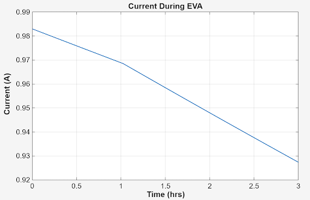

# MBSE & MathWorks systems handbook

## Description
This repository contains documentation demonstrating the use of MathWorks systems in the design of a Lunar Sample Containment System. All material was created by a team of undergraduates at the University of Michigan as part of a project associated with the [Aerospace X88](https://aero.engin.umich.edu/undergraduate/program-overview/mbse-at-u-m/) course series and [NASA’s RASC-AL](https://rascal.nianet.org/) competition. To successfully design this system, MBSE methodologies were followed, such as moving through the systems V diagram from requirements to final verification and validation. In this project, MathWorks systems were primarily utilized during the verification and validation portions of the design process. MATLAB provides suitable data analysis tools to confirm requirements and identify any malfunctions in the system. Simulink was used to lay out electronic systems and controls, such as identifying the temperature in the control volume and verifying their functionality. The system itself is designed to maintain the temperature and pressure needed to store lunar samples during transit between habitats or rovers on lunar missions. Some of the systems demonstrated in this repository include the temperature sensing and warning system, the battery power and control system, as well as the cooling system itself.
## Examples

<table>
<tr>

<td align="center">
  
   
  <b>MATLAB Graphing</b>
   
  <small>Visualization of experimental data using MATLAB plotting tools.</small>
</td>

<td align="center">
  
   
  <b>MATLAB Graphing</b>
   
  <small>Comparison of multiple datasets with customized graph formatting.</small>
</td>

<td align="center">
  
   
  <b>MATLAB Graphing</b>
   
  <small>Processed data displayed with labeled axes and legends.</small>
</td>

</tr>

<tr>

<td align="center">
  
   
  <b>MATLAB Graphing</b>
   
  <small>Final visualization highlighting key trends in the results.</small>
</td>

<td align="center">
  
   
  <b>Thermal Simulation</b>
   
  <small>Simulink model used to simulate the thermal behavior of the system.</small>
</td>

<td align="center">
  
   
  <b>Thermal Simulation</b>
   
  <small>Simulation results showing temperature response over time.</small>
</td>

</tr>
</table>

## MATLAB
blah blah blah
## Simulink
To ensure that electronic systems were able to run under given thermal and electrical loads, the RASC-AL team utilized Simulink to set up an electro-thermal battery simulation. The simulation demonstrates the effect of all of the layers on metal, insulation, and PCM (phase change material) on protecting the system's battery from the lunar surface temperature. The simulation reads the battery's temperature as well as the current and voltage output after the application of the thermal load. 
<td align="center">
  
</td>

The left-hand side of the simulation contains the thermal aspects, including the controlled source that represents the lunar surface temperature during lunar day as well as the material layers and their properties standing between the lunar surface and the battery. Then, in the center, are multiple blocks storing information about the battery, such as its heat capacity, internal resistance, and mass. These pieces of information are needed to ensure the battery is as accurate in the simulation compared to real life as possible. Finally, on the right-hand side of the simulation, the electronic measuring elements are present. These are what are sensing and outputting the current, voltage, battery temperature, and the state of change for the system.

Another simulation the team utilized was one demonstrating that the PCB circuit board being used would not get too hot during operation to impede its functionality nor would the aluminum it was mounted on.
<td align="center">
  
</td>

## Practical Applications

<td align="center">
  
   
  <b>Lab 6 control system</b>
   
  <small>Simulation results showing temperature response over time.</small>
</td>
<td align="center">
  
   
  <b>Lab 6 control system</b>
   
  <small>Simulation results showing temperature response over time.</small>
</td>

