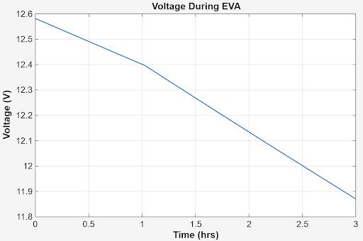

# MBSE & MathWorks systems handbook

## Contents

- Description
- Examples
- MATLAB
- Simulink
- Practical Applications

## Description

## Examples

<table>
  <tr>
    <td align="center">
    <!--  <a href="mechanics/stress.md"> (this makes this line not read) -->
        
      <!-- </a>   -->
      <b>MATLAB Graphing </b>
    </td>

    <td align="center">
      <!-- <a href="mechanics/buckling.md"> -->
        
      <!-- </a>   -->
      <b>MATLAB Graphing</b>
    </td>

    <td align="center">
     <!-- <a href="fluids/flow.png"> -->
        
      <!-- </a>   -->
      <b>MATLAB Graphing</b>
    </td>
  </tr>
</table>

## MATLAB
## Simulink
#  Practical Applications
